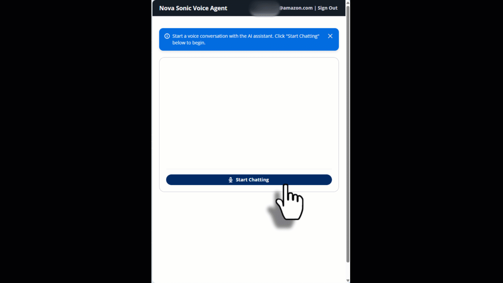

# Amazon Nova Sonic over WebSocket with Amazon Bedrock AgentCore

A real-time voice conversational AI web interface built with **React**, powered by **Amazon Nova Sonic**, and deployed on **AWS Bedrock AgentCore** using **Strands BidiAgent**. Complete infrastructure scaffolding with authentication, WebSocket streaming, and web interface - deployment automated in one command.

**🎯 Purpose**: This is a complete, ready to use sample that demonstrates how to build bidirectional voice agents with AWS Bedrock AgentCore. Use it to:
- **Learn**: Explore the debug console to understand WebSocket events, audio processing, and token usage
- **Reuse**: Copy the React frontend code and customize it for your own voice applications
- **Deploy**: One-command deployment to AWS with full infrastructure as code



## Table of Contents

- [Features](#features)
- [Architecture](#architecture)
- [Quick Start](#quick-start)
  - [Cloud Deployment](#cloud-deployment)
  - [Local Development & Testing](#local-development--testing)
- [Using the Voice Agent](#using-the-voice-agent)
- [Manual Deployment & Updates](#manual-deployment--updates)
- [Cleanup](#cleanup)
- [Troubleshooting](#troubleshooting)
- [Architecture & Project Structure](#architecture--project-structure)
- [Security](#security)
- [Cost Estimate](#cost-estimate)
- [Customizing the UI](#customizing-the-ui)
- [Next Steps](#next-steps)
- [Resources](#resources)
- [Contributing](#contributing)

---

## Features

- 🎤 **Voice-Only Experience**: Real-time bidirectional voice conversations with Nova Sonic
- 🔊 **Continuous Conversation**: Natural voice interaction with automatic turn-taking
- 📝 **Real-Time Transcripts**: Live transcription of both user and assistant speech
- 💬 **Conversation History**: Full chat history with chat-bubble responses
- 🎙️ **Audio Visualization**: Loading bar during agent responses
- 🔄 **Barge-In Support**: Interrupt the assistant while it's speaking
- 🌐 **Modern Web Interface**: Built with AWS Cloudscape Design System
- ☁️ **AWS Deployment**: Deployed on AWS Bedrock AgentCore with WebSocket support
- 🛠️ **Tool Use**: Calculator and weather tools with asynchronous execution

## Architecture


This demo uses four CloudFormation stacks for separation of concerns:
- **Infrastructure**: ECR, S3, CodeBuild (rarely changes)
- **Authentication**: Cognito User Pool and Identity Pool (rarely changes)
- **Runtime**: AgentCore with WebSocket support (updates with agent code)
- **Frontend**: CloudFront + S3 (updates with UI changes)

For detailed architecture information, see **[docs/ARCHITECTURE.md](docs/ARCHITECTURE.md)**.

## Quick Start

Choose your deployment mode:
- **[Cloud Deployment](#cloud-deployment)** - Deploy the full application to AWS with authentication and production infrastructure
- **[Local Development & Testing](#local-development--testing)** - Run locally for rapid development without AWS deployment

### Cloud Deployment

Deploy the full application to AWS with authentication, infrastructure, and production-ready setup.

#### Prerequisites on your laptop
- **AWS CLI v2.31.13 or later** installed and configured ([Installation Guide](https://docs.aws.amazon.com/cli/latest/userguide/getting-started-install.html))
  - Check your version: `aws --version`
  - AgentCore support was added in AWS CLI v2.31.13 (January 2025)
- **Node.js 22+** installed (for CDK deployment)
- **AWS credentials** configured with permissions for CloudFormation, Lambda, S3, API Gateway, Cognito, and IAM via:
  - `aws configure` (access key/secret key)
  - AWS SSO: `aws sso login --profile <profile-name>`
  - Environment variables: `AWS_ACCESS_KEY_ID`, `AWS_SECRET_ACCESS_KEY`

#### ⚠️ Important: Region Requirements

**Amazon Bedrock AgentCore is only available in specific AWS regions.**

Before deploying, verify AgentCore availability in your target region by checking the [AWS AgentCore Regions Documentation](https://docs.aws.amazon.com/bedrock-agentcore/latest/devguide/agentcore-regions.html).

> **Region note**: `AWS_REGION` is automatically detected from your AWS CLI profile (`aws configure get region`) and controls where all infrastructure deploys. `BEDROCK_REGION` controls where Nova Sonic model calls are made — defaults to `us-east-1`. Nova Sonic is only available in select regions; check [model availability](https://docs.aws.amazon.com/bedrock/latest/userguide/models-regions.html) and update `BEDROCK_REGION` in `cdk/lib/runtime-stack.ts` if needed.

#### One-Command Deploy

**Windows (PowerShell):**
```powershell
.\deploy-all.ps1
```

**macOS/Linux (Bash):**
```bash
chmod +x deploy-all.sh scripts/build-frontend.sh
./deploy-all.sh
```

**Time:** ~10 minutes (includes container build for WebSocket support)

**Done!** Your voice agent is live at the CloudFront URL shown in the output.

#### Test Your Voice Agent

1. Open the CloudFront URL from deployment output
2. **Click "Start Chatting"** to establish WebSocket connection
3. **Speak naturally** - the agent will listen and respond automatically
4. Listen to the assistant's voice response
5. See real-time transcripts of the conversation
6. **Try the tools**: Ask for calculations ("what's 25 times 4?") or weather ("what's the weather?")

**Note**: This is a voice-only interface with continuous conversation - no text input needed.

### Local Development & Testing

Run the application locally for rapid development without deploying any AWS infrastructure. Perfect for testing agent code changes quickly.

#### Local Development Mode

**Prerequisites on your laptop:**
- **Python 3.8+** with pip (to run the agent locally)
- **Node.js 18+** with npm (to run the frontend dev server)
- **mkcert** for local HTTPS certificates (required for WSS WebSocket support)
  - Windows: `winget install FiloSottile.mkcert` then `mkcert -install`
  - macOS: `brew install mkcert && mkcert -install`
  - Linux: see [mkcert releases](https://github.com/FiloSottile/mkcert/releases)
  - After installing, generate the cert once: `cd frontend && mkcert localhost`
- **AWS credentials** configured (only for Bedrock API calls - no infrastructure deployment)
  - `aws configure` or AWS SSO login
  - Credentials only used to call Bedrock models, not to deploy resources

**Note:** Local development has simpler requirements than cloud deployment - no AWS CLI v2.31.13+ or Node.js 22+ needed since you're not deploying infrastructure.

**Start Local Development:**

**Windows (PowerShell):**
```powershell
.\dev-local.ps1
```

**macOS/Linux:**
```bash
chmod +x dev-local.sh
./dev-local.sh
```

This will:
1. Create a Python virtual environment and install agent dependencies
2. Install frontend dependencies
3. Start the voice agent locally on `http://localhost:8080`
4. Start the frontend dev server on `https://localhost:5173` (HTTPS via mkcert)
5. Configure the frontend to call the local agent (no authentication required)

**Local Development Features:**
- ✅ Full voice UI with WebSocket connection
- ✅ Frontend hot reload (Vite dev server)
- ✅ Fast agent restart cycle (no deployment needed)
- ✅ Authentication bypassed for local testing
- ✅ Same agent code as production
- ✅ Real-time voice streaming and transcripts
- ✅ Rapid iteration without AWS deployment

**How Local Development Works:**
- `python strands_agent.py` starts FastAPI server with WebSocket endpoint
- Agent creates WebSocket server on `localhost:8080/ws`
- Frontend connects to local agent via WebSocket
- Agent executes bidirectional voice streaming with Nova Sonic
- No Docker, no containers needed - just Python + web server

**Development Workflow:**

If you make any frontend changes (located under `frontend/`), hot reload will trigger automatically via Vite. Your changes will be visible instantly in the browser without restarting anything.

If you want to make any modification to your agent code (`agent/` files), a script restart is required. Press Ctrl+C to stop the script, then re-run it to see your agent changes.

**Note:** Agent restart takes ~10 seconds vs ~10 minutes for production deployment.

**No Deployed Infrastructure Required:**
- Local testing works without any deployed AWS stacks
- Only requires AWS credentials for Bedrock API calls
- Perfect for development before deploying to production

## Architecture & Project Structure

For detailed architecture information, stack design, and project structure, see **[docs/ARCHITECTURE.md](docs/ARCHITECTURE.md)**.

## Using the Voice Agent

1. Open the CloudFront URL from deployment output
2. Sign in or create an account (email verification required)
3. Click "Start Chatting" to begin voice conversation
4. Speak naturally - the agent listens and responds automatically
5. Try asking for calculations or weather information
6. Click "Stop Conversation" when done

For local testing options, see the [Local Development & Testing](#local-development--testing) section above.

## Debug Console

The project includes a standalone debug console at `frontend/debug.html` for inspecting WebSocket activity during local development.

Open it directly in your browser while the local agent is running:
```
http://localhost:5173/debug.html
```

It gives you:
- Live WebSocket event log with timestamps and color-coded event types (info, success, warning, error)
- Real-time transcripts for both user and agent turns
- Network stats (messages sent/received, bytes transferred)
- Export logs button for sharing diagnostics

Useful when debugging agent behavior, audio issues, or WebSocket connectivity. Not needed for production use.

## Manual Deployment & Updates

For step-by-step deployment instructions, updating agent code, or troubleshooting deployments, see **[docs/DEPLOYMENT.md](docs/DEPLOYMENT.md)**.

## Cleanup

```bash
cd cdk
npx cdk destroy AgentCoreNovaSonicBidiFrontend --no-cli-pager
npx cdk destroy AgentCoreNovaSonicBidiRuntime --no-cli-pager
npx cdk destroy AgentCoreNovaSonicBidiAuth --no-cli-pager
npx cdk destroy AgentCoreNovaSonicBidiInfra --no-cli-pager
```

**Note:** Cognito User Pool will be deleted along with all user accounts.

## Troubleshooting

For detailed troubleshooting guidance, see **[docs/TROUBLESHOOTING.md](docs/TROUBLESHOOTING.md)**.

### Quick Fixes

**Deployment fails with "Unrecognized resource types"**
- AgentCore is not available in your region
- Check [supported regions](https://docs.aws.amazon.com/bedrock-agentcore/latest/devguide/agentcore-regions.html) and set `AWS_REGION` environment variable

**"Connection closed unexpectedly (code 1006)"**
- Check CloudWatch logs: `aws logs tail "/aws/bedrock-agentcore/runtimes/{runtime-id}-DEFAULT" --follow`
- Look for import errors or missing dependencies
- See [WebSocket troubleshooting guide](docs/TROUBLESHOOTING.md#websocket-connection-errors)

**Authentication issues**
- Verify AWS credentials: `aws sts get-caller-identity`
- Check Cognito configuration in stack outputs
- See [authentication troubleshooting](docs/TROUBLESHOOTING.md#authentication-issues)

**Need help?** Check the [complete troubleshooting guide](docs/TROUBLESHOOTING.md) for detailed solutions.

## Security

- **Authentication required** - WebSocket connections protected by IAM SigV4 signing
- **Email verification** - Users will be asked to verify email before access (use real email)
- **Password policy** - Enforced minimum complexity requirements
- **AWS Credentials** - Temporary credentials vended via Cognito Identity Pool
- **Least Privilege IAM** - Authenticated role has minimal Bedrock AgentCore permissions
- Frontend served via HTTPS (CloudFront)
- AWS credentials automatically refreshed by SDK
- AgentCore Runtime runs in isolated microVMs
- Code stored securely in S3
- Origin Access Control (OAC) for S3/CloudFront
- Credentials never exposed to browser (managed by AWS SDK)

## Cost Estimate

Approximate monthly costs for US East (N. Virginia) region:

**Authentication & User Management:**
- **Cognito**: Free for first 10,000 MAUs (Monthly Active Users), then $0.015 per MAU. This demo uses email/password authentication (no SAML/OIDC federation)

**Agent Runtime & Compute:**
- **AgentCore Runtime**: Consumption-based pricing - $0.0895 per vCPU-hour + $0.00945 per GB-hour (only charged for active processing time, I/O wait is free)
- **Bedrock Model (Nova 2 Sonic)**: Voice model pricing - check [AWS Bedrock Pricing](https://aws.amazon.com/bedrock/pricing/) for current rates

**Frontend & Content Delivery:**
- **CloudFront**: Always free tier includes 1 TB data transfer out/month + 10M HTTP/HTTPS requests/month. After free tier: $0.085 per GB (next 9 TB) + $0.01 per 10,000 HTTPS requests
- **S3 (Static Hosting)**: $0.023 per GB-month storage + $0.0004 per 1,000 GET requests (negligible for static sites)

**Code Storage:**
- **S3 (Code Storage)**: $0.023 per GB-month storage (agent code is typically <10 MB, negligible cost)

**Monitoring & Logs:**
- **CloudWatch Logs**: $0.50 per GB ingested + $0.03 per GB stored (first 5 GB ingestion free)

**Infrastructure (No Cost):**
- **CloudFormation**: Free for stack operations
- **IAM**: Free

**Typical demo cost**: $2-10/month with light usage (100-500 requests/month)
- AgentCore Runtime: ~$0.50-3/month (assuming 30-60 seconds per request, 1 vCPU, 2 GB memory)
- Bedrock Model (Nova Sonic): ~$1-4/month (depends on conversation length)
- CloudFront, S3: Covered by free tiers for light usage
- CloudWatch Logs: ~$0.50-1/month
- Other services: Free or negligible

**Note**: Costs scale with usage. High-volume production workloads will incur higher costs, especially for AgentCore Runtime and Bedrock model invocations.

## Customizing the UI

The frontend uses [AWS Cloudscape Design System](https://cloudscape.design/) for a modern, accessible interface. For detailed customization examples and guides, see **[docs/CUSTOMIZATION.md](docs/CUSTOMIZATION.md)**.

Quick examples:
- Change support prompts in `frontend/src/App.tsx`
- Customize colors with design tokens in `frontend/src/theme.css`
- Modify markdown styling in `frontend/src/markdown.css`
- Add feedback buttons and custom actions

## Next Steps

- **Add Tools**: Create custom `@tool` functions in the agent. 
- **Customize the weather tool** to make it fetch real weather forecast data from a weather API
- **Add Memory**: Integrate AgentCore Memory for persistent context
- **Custom Domain**: Add Route53 and ACM certificate to frontend stack
- **Social Login**: Add Google/Facebook OAuth to Cognito

## Resources

- [Strands Bidirectional Streaming Documentation](https://strandsagents.com/latest/documentation/docs/user-guide/concepts/bidirectional-streaming/agent/)
- [AgentCore WebSocket Runtime Guide](https://docs.aws.amazon.com/bedrock-agentcore/latest/devguide/runtime-get-started-websocket.html)
- [Amazon Nova Conversational Speech Documentation](https://docs.aws.amazon.com/nova/latest/nova2-userguide/using-conversational-speech.html)

## Contributing

1. Fork the repository
2. Create a feature branch
3. Make your changes
4. Test thoroughly
5. Submit a pull request

## Support

For issues and questions:
- Check the troubleshooting section
- Review AWS Bedrock documentation
- Open an issue in the repository
## Security

See [CONTRIBUTING](CONTRIBUTING.md#security-issue-notifications) for more information.

## License

This library is licensed under the MIT-0 License. See the LICENSE file.